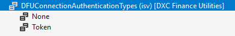
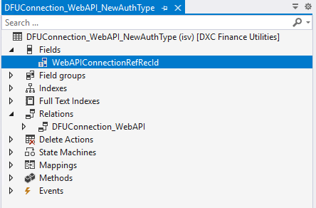
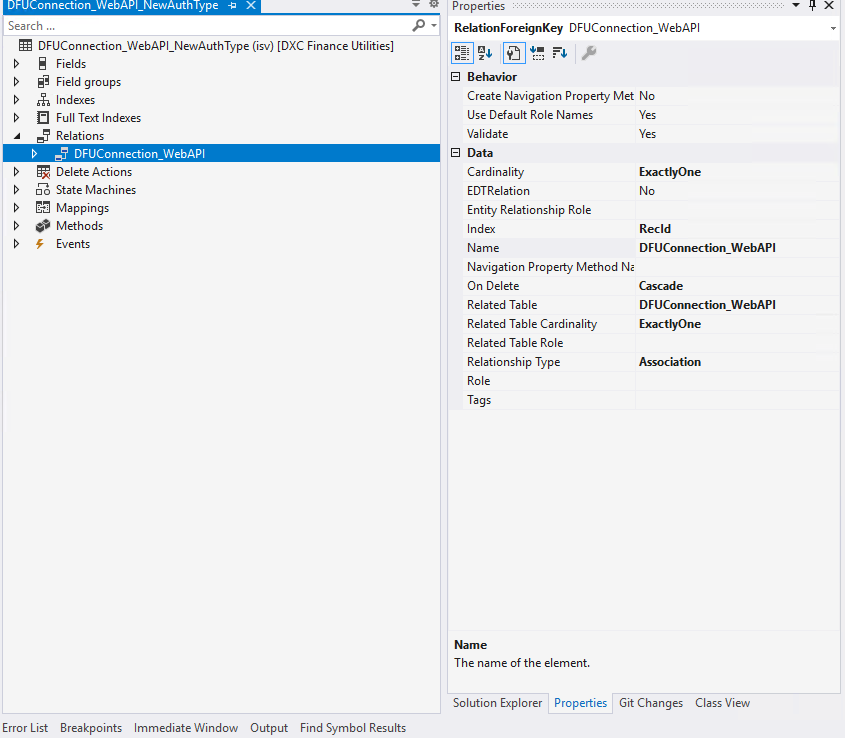
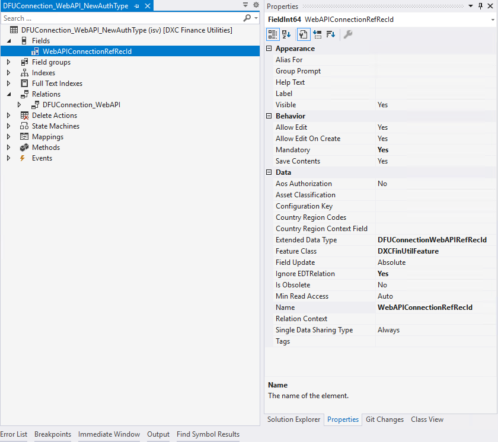
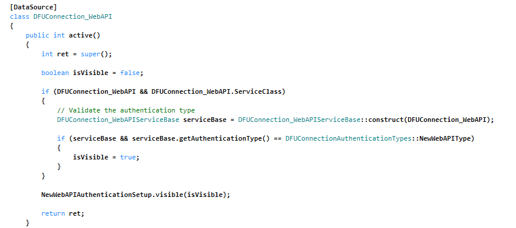

# Finance Utilities Technical Guide

<!-- TOC -->

- [Finance Utilities Technical Guide](#finance-utilities-technical-guide)  
    - [Overview](#overview)
    - [Finance Utilities Connections](#finance-utilities-connections)
        - [Web API Endpoint](#web-api-endpoint)
            - [Create new Web API Type](#create-new-web-api-type)
            - 

<!-- /TOC -->

## Overview  
The DXC Finance Utilities module provides enhanced functionalities to Microsoft Dynamics 365 for Finance and Operations (FinOps). This guide provides an overview of the technical requirements for making extensions to specific features.

## Finance utilities connections
See [guide](https://dxcanzproduct.github.io/DXC-Products-for-Microsoft-Business-Applications/FINU/Setup/CASH-AND-BANK-MANAGEMENT/Finance-utilities-connections.html) for configuration/setup information

### Web API Endpoint
Finance Utilities allows users to configure external web service connections within FinOps. The solutions offers capabilities such as configuring/implement new Web API types.  

This section describes how the solution can be extended to add additional Web API Types
See [guide](https://dxcanzproduct.github.io/DXC-Products-for-Microsoft-Business-Applications/FINU/Technical/Web-API-Endpoint.html) for details on Web API Endpoint connection.

#### Create new Web API Type
**Extend base class**  
Extend and implement the base class, DFUConnection_WebAPIServiceBase, to create the new Web API Type within Finance utilities. This action will register the Web API Type and will become accessible for new connection setup.  

Example:  
``` c#
public class DFUConnection_WebAPIServiceBase_NewWebAPIType extends DFUConnection_WebAPIServiceBase
```

Use the attribute, DFUConnection_WebAPIServiceClassFactory, to specify the name of the class to be registered.  
Example:  
``` c#
[DFUConnection_WebAPIServiceClassFactory(classStr(DFUConnection_WebAPIServiceBase_NewWebAPIType))]
public class DFUConnection_WebAPIServiceBase_NewWebAPIType extends DFUConnection_WebAPIServiceBase
{
    // Your implementation goes here
}
```
**New Authentication Type**  
If there is no need to implement a new authentication type then you can skip this.  

Create an extension of the enum, DFUConnectionAuthenticationTypes and add the new authentication type. This will be utilized later on to render the view for the Web API endpoint connection.  
  

Create a new table that will host the parameters for the new authentication type.  
  

Add a relation to the parent table which consists of the Web API endpoint configuration, DFUConnection_WebAPI.  
  

Add reference field for the Web API endpoint table record identifier.  
  

Create an extension of DFUConnection and DFUGERExportConnection forms and add this new table as a data source. Ensure to join this with the existing data source,DFUConnection_WebAPI.  

Initialize and access any methods within the Web API type implementation as shown below.  

Example: Control visibility of the authentication parameters based on the authentication type.  
  

**Existing Authentication Type - Token**  
If the external web service utilizes a token based bearer authentication, then existing classes can be used to create a new Web API Type.  

To achieve this create an extension of the abstract class, DFUConnection_WebAPIServiceBase_AuthTypeToken.  

This class already implements the following methods.  
- init - Initializes the DFUConnection_WebAPI_OAuth data source
- getAuthenticationType - Default token
- validateConnection - Sends a HTTPS request to the specified validate connection parameter within the finance utilities connection/electronic reporting export connections and validates a favourable response is returned.  

Other methods accessible  
**_getAaDAuthorityUri_**  
Gets the Azure Active Directory Authority URI based on the connections settings for OAuth, example, https://login.microsoftonline.com/xxx.onmicrosoft.com  

**_getManualSecret_**  
Gets the Azure Active Directory app registration secret based on the key vault parameter setup in connections.  

**_getBearerToken_**  
Gets the bearer token generated using the OAuth configuration setup in connections.  

**Class implementation**  
**_init_**  
Use the following code snippet for existing authentication type - **Token**  

If a new implementation type is used  
``` c#
protected DFUConnection_WebAPI_OAuth webAPIOAuthCOnnection;

public void init()
{
    DFUConnection_WebAPI connectionWebAPI = this.connection_WebAPI as DFUConnection_WebAPI;

    webAPIOAuthCOnnection = DFUConnection_WebAPI_OAuth::find(connectionWebAPI.RecId);
}
```  
Note: This is already implemented in the base class for token based authentication, DFUConnection_WebAPIServiceBase_AuthTypeToken and can be skipped in the implementation class.  

Use the following pseudocode for new authentication type  
Example: New Authentication type  
``` c#
protected DFUConnection_WebAPI_NewAuthType webAPINewAuthTypeConnection;

public void init()
{
    DFUConnection_WebAPI connectionWebAPI = this.connection_WebAPI as DFUConnection_WebAPI;

    webAPINewAuthTypeConnection = DFUConnection_WebAPI_NewAuthType::find(connectionWebAPI.RecId);

    // Initialization goes here
}
```  
**_getAuthenticationType_**  
Specify the authentication type for the implementation.  

Note: This is already implemented in the base class for token based authentication, DFUConnection_WebAPIServiceBase_AuthTypeToken and can be skipped in the implementation class.  

**validationConnection**  
If there is no use case for validation connection then this can be skipped.  

Implement any logic to perform a health check against the Web API instance to validate connection.  

Example:  
``` c#
public boolean validateConnection()
{
    boolean ret = false;

    // Your implementation goes here

    return ret;
}
```  

Note: This is already implemented in the base class for token based authentication, DFUConnection_WebAPIServiceBase_AuthTypeToken and can be skipped in the implementation class.  

**getName**  
Specify the name of the Web API type.  
Example:  
``` c#
public Name getName()
{
    return "New Web API type";
}
```  

**getDescription**  
Specify a description of the Web API type.  
Example:  
``` c#
public Description getDescription()
{
    return "New Web API type description";
}
```  

**getDirection**  
This is an additional option that can be configured to specify the processing type, to seperate logic for import and export.  
Example:  
``` c#
public final DFUConnectionProcessType getDirection()
{
    return DFUConnectionProcessType::Export;
}
```  

**run**  
Implement the core logging for processing data specific to the Web API type.  
Example:
``` c#
public void run()
{
    // Process your logic
}
```  

Full class Example:  
``` c#
[DFUConnection_WebAPIServiceClassFactory(classStr(DFUConnection_WebAPIServiceBase_NewWebAPIType))]
public class DFUConnection_WebAPIServiceBase_NewWebAPIType extends DFUConnection_WebAPIServiceBase
{   
    protected DFUConnection_WebAPI_NewAuthType webAPINewAuthTypeConnection;

    public void init()
    {
        DFUConnection_WebAPI connectionWebAPI = this.connection_WebAPI as DFUConnection_WebAPI;

        webAPINewAuthTypeConnection = DFUConnection_WebAPI_NewAuthType::find(connectionWebAPI.RecId);

        // Initialization goes here
    }

    public DFUConnectionAuthenticationTypes getAuthenticationType()
    {
        return DFUConnectionAuthenticationTypes::None;
    }

    public boolean validateConnection()
    {
        boolean ret = false;

        // Your implementation goes here

        return ret;
    }

    public Name getName()
    {
        return "New Web API type";
    }

    public Description getDescription()
    {
        return "New Web API type description";
    }

    public final DFUConnectionProcessType getDirection()
    {
        return DFUConnectionProcessType::Export;
    }

    public void run()
    {
        // Process your logic
    }
}
```  

**Note:** DFUConnection_WebAPIServiceBase_AuthTypeToken_Import and DFUConnection_WebAPIServiceBase_AuthTypeToken_Export consists of logic for processing import and export of files against an external service


