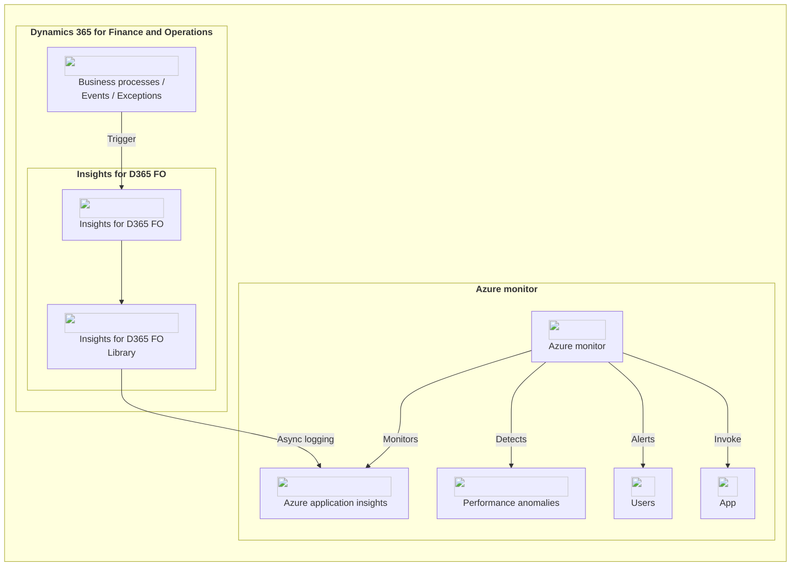
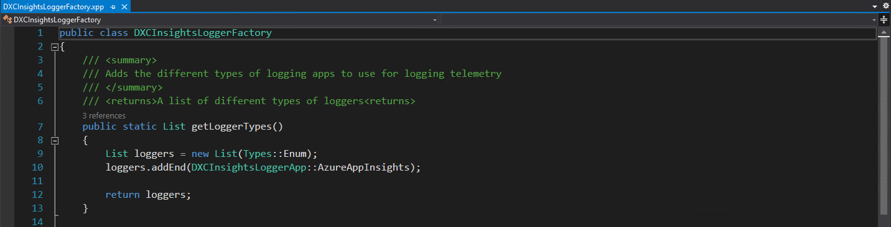

# Insights for D365 FO

## Technical guide

### Overview

Insights for D365 FO will capture data such as user information, time to load, and menu item used. Telemetry is subsequently transmitted through to a logging application. It will record errors, saving error messages and call stacks. Insights can monitor recurring events and exceptions, even those occuring during Dual-write sync.

To install Insights for D365 FO, first check to make sure you have the latest copy of the installation files.

The solution is delivered as a deployable package only. 

Refer to the following link on how to [Manage third-party models and runtime packages by using source control](https://docs.microsoft.com/en-us/dynamics365/fin-ops-core/dev-itpro/dev-tools/manage-runtime-packages#deployable-packages-from-third-parties).

Release notes are available at https://dxcanzproduct.github.io/DXC-Products-for-Microsoft-Business-Applications/LMG/Release-notes.html
User guides are available at https://dxcanzproduct.github.io/DXC-Products-for-Microsoft-Business-Applications/LMG/Introduction.html

### Licensing
Insights for D365 FO License is managed using DXC License Manager.

### Architecture


### Additonal event logging
The solution can be extended to add additonal telemetry logging by calling any of the following static methods on the 'DXCInsightsLogEvents' class :
* logError
  * Parameter: DXCInsightsLogErrorContract __contract_
  * Purpose: logs exceptions/errors caught on FO
* logRequest
  * Parameter: DXCInsightsLogRequestContract __contract_
  * Purpose: logs all requests received by FO
* logPageView
  * Parameter: DXCInsightsLogPageViewContract __contract_
  * Purpose: logs form runs and page views
* logEvent 
  * Parameter: DXCInsightsLogEventContract __contract_
  * Purpose: logs custom events general events on FO like batch jobs and more
* logMetric 
  * Parameter: DXCInsightsLogMetricContract __contract_
  * Purpose: logs special metrics and performance related values
* dxcAppInsightLogWebService
  * Parameter: System.Diagnostics.Stopwatch __stopWatch_, str __className_, str __methodName_
  * Purpose: logs web service related calls (needs to implemented separately on custom web servcies)

Below is an example code snippet that demonstrates how to log telemetry on business event publishment:

```x++
[ExtensionOf(classStr(BusinessEventsPublisher))]
internal final class BusinessEventsPublisher_DXCInsights_Extension
{
    public void publish(BusinessEventsBase _businessEvent)
    {
        next publish(_businessEvent);

        if (DXCInsightsFeature::isEnabled())
        {
            DXCInsightsLogEvents::logEvent(
                    DXCInsightsLogEventContract::newFromTypeAndName(
                        DXCInsightsLoggingType::LogBusinessEvents, _businessEvent.getBusinessEventsContract().parmBusinessEventId()));
        }
    }

}
```

### Additional loggers
1. Implement the DXCInsightsILoggerApp interface

 Additional loggers can be added by adding a new class that implements the 'DXCInsightsILoggerApp' interface with logic to insert telemetry into your logging app. The 'DXCInsightsILoggerApp' is an  exportable interface that contains the following methods that need to be implemented:
 * logError
   * Parameter: DXCInsightsLogErrorContract __contract_
   * Purpose: logs exceptions/errors caught on FO
 * logPageView
   * Parameter: DXCInsightsLogPageViewContract __contract_
   * Purpose: logs form runs and page views
 * logEvent
   * Parameter: DXCInsightsLogEventContract __contract_
   * Purpose: logs custom events general events on FO like batch jobs and more
 * logMetric 
   * Parameter: DXCInsightsLogMetricContract __contract_
   * Purpose: logs special metrics and performance related values
 * logRequest
   * Parameter: DXCInsightsLogRequestContract __contract_
   * Purpose: logs all requests received by FO


2. Extend the DXCInsightsLoggerApp enum

 Add a new enum value to the DXCInsightsLoggerApp that matches the name of the your custom logger


3. Extend the DXCInsightsLoggerFactory class

 Create a CoC on the DXCInsightsLoggerFactory::getLoggerTypes() method and add your custom logger to the end of the loggers list.
 

### Note

To maintain optimal performance efficiency, it is important to ensure that telemetry logging to your custom loggers is performed asynchronously. By logging telemetry asynchronously, you can avoid blocking the execution of your application and improve its responsiveness.

### Extensibility support for additional periodic monitoring events

Developers have the flexibility to introduce additional monitoring events beyond what the product has originally provided. These new events could be tailored to specific requirements, such as tracking unique behaviors or activities within the application. To add new periodic monitoring events, create a class that extends the DXCInsights_MonitoringBase class, and add your custom contract parameters and business rules processing logic. See example below:


```x++
public final class DXCInsights_AdditionalMonitoringEvents extends DXCInsights_MonitoringBase
{
    /// <summary>
    /// Sets the default values for the contract.  This
    /// can be changed through the parameters form.
    /// </summary>
    public void setContractDefaults()
    {
        super();

        // Set default refresh interval to run every 5 hours
        contract.parmRefreshIntervalValue(5);
        contract.parmRefreshIntervalUnit(DXCInsights_MonitoringRefreshIntervalUnit::Hours);

        //add additonal parameters that will be visible on the Periodic monitoring configuration form
        contract.addParm(
            DefaultMonitoringDaysLineNum,
            literalStr("@DXCInsights:AdditionalMonitoringEventParameterName"),
            literalStr("@DXCInsights:AdditionalMonitoringEventParameterDescription"),
            10,
            DXCInsights_MonitoringParameterCustomizationType::Integer);

    }
    /// <summary>
    /// Default description and purpose of this class.
    /// </summary>
    /// <returns>Description of this class</returns>
    public ClassDescription description()
    {
        return "@DXCInsights:AdditionalMonitoringEventClassDescription";
    }

    public void run()
    {
        super();

        // Your logic/ monitoring rule will be added here         
        Map mapContainingTelemetryToBeLogged = AdditionalMonitoringEvent::processRules();

        //send telemetry to be logged with Insights for D365 FO
        this.sendTelemetryForLogging(mapContainingTelemetryToBeLogged);
    }

    private void sendTelemetryForLogging(Map _map)
    {
        if (_map.elements() > 0)
        {
            str eventName = "@DXCInsights:AdditionalMonitoringEventClassDescription";

            MapEnumerator mapEnumerator = _map.getEnumerator();
            while (mapEnumerator.moveNext())
            {
                DXCInsightsLogEvents::logEvent(
                  DXCInsightsLogEventContract::newFromTypeAndName(
                      DXCInsightsLoggingType::LogCustom, eventName, mapEnumerator.currentValue()));
            }
        }
    }

}
```

Ensure to click the **'Refresh list'** button on the Periodic monitoring configuration page after compiling your solution. This will add your new  monitoring event to the existing list of monitoring events provided within the Insights for D365 FO solution.

### Add custom logic for Number sequence monitoring
Number Sequence Monitoring is a process where an organization tracks and manages how number sequences are used within the system. The existing logic for number sequence monitoring might be basic and may not meet all the requirements of the organization. To address this, more advanced and intricate logic may be needed which may vary from organization to organization. This could involve complex rules, conditions, or algorithms to monitor and manage number sequences effectively.

To add a custom logic for number sequence monitoring, create a CoC on the 'execute()' method of the 'DXCInsights_MonitoringNumberSequencesProcess' class. We have tagged the 'exceute' method with the 'Replceable' attribute, so you will not need to call NEXT command in Chain of Command (CoC) and completely override the logic written in the DXCInsights_MonitoringNumberSequencesProcess::execute() method. We recommend using this NEXT command conditionally.
Example:
```x++
[ExtensionOf(classStr(DXCInsights_MonitoringNumberSequencesProcess))]
final class DXCInsights_MonitoringNumberSequencesProcess_Extension
{
    public static Map execute()
    {
        Map ret;
        boolean runOriginalMethod = false; // your logi to set the boolean variable here

        if (runOriginalMethod)
        {
            ret = next execute();
        }
        else
        {
            // your logic for number sequence monitoring here
            ret = someMethod();
        }

        return ret;
    }
}
```